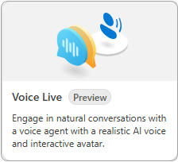

---
lab:
  title: Esplorare l'API Voice Live
  description: Informazioni su come usare e personalizzare l'API Voice Live disponibile nel playground Fonderia Azure AI.
---

# Esplorare l'API Voice Live

In questo esercizio si crea un agente in Fonderia Azure AI e si esplora l'API Voice Live nel playground Voce. 

Questo esercizio richiede circa **30** minuti.

> <span style="color:red">**Nota**:</span> Alcune delle tecnologie usate in questo esercizio sono attualmente in anteprima o in fase di sviluppo. È possibile che si verifichino alcuni comportamenti, avvisi o errori imprevisti.

> <span style="color:red">**Nota**:</span> Questo esercizio è progettato per essere completato in un ambiente browser con accesso diretto al microfono del computer. Anche se i concetti possono essere esplorati in Azure Cloud Shell, le funzionalità vocali interattive richiedono l'accesso all'hardware audio locale.

## Creare un progetto Fonderia Azure AI

Per iniziare, creare un progetto Fonderia Azure AI.

1. In un Web browser, aprire il [Portale Fonderia Azure AI](https://ai.azure.com) su `https://ai.azure.com` e accedere usando le credenziali di Azure. Chiudere tutti i riquadri dei suggerimenti o di avvio rapido che vengono aperti al primo accesso e, se necessario, usare il logo **Fonderia Azure AI** in alto a sinistra per passare alla home page, simile all'immagine seguente (chiudere il riquadro **Aiuto** nel caso sia aperto):

    

1. Nella home page, selezionare **Crea un agente**.

1. Nella procedura guidata **Crea un agente**, immettere un nome valido per il progetto. 

1. Selezionare **Opzioni avanzate** e specificare le impostazioni seguenti:
    - **Risorsa di Fonderia Azure AI**: *mantenere il nome predefinito*
    - **Sottoscrizione**: *la sottoscrizione di Azure usata*
    - **Gruppo di risorse**: *creare o selezionare un gruppo di risorse*
    - **Area**: Selezionare in modo casuale un'area dalle opzioni seguenti:\*
        - Stati Uniti orientali 2
        - Svezia centrale

    > \* Al momento della stesura di questo articolo, l'API Voice Live è supportata solo nelle aree elencate in precedenza. La selezione di una posizione in modo casuale consente di garantire che una singola area non venga sovraccaricata di traffico e consente di ottenere un'esperienza più fluida. Nel caso in cui vengano raggiunti i limiti del servizio, è possibile che sia necessario creare un altro progetto in un'area diversa.

1. Selezionare **Crea** e rivedere la configurazione. Attendere il completamento del processo di configurazione.

    >**Nota**: se viene visualizzato un errore di autorizzazione, selezionare il pulsante **Correggi** per aggiungere le autorizzazioni appropriate per continuare.

1. Quando il progetto viene creato, per impostazione predefinita viene visualizzato il playground Agenti nel portale Fonderia Azure AI, simile al seguente:

    

## Avviare un esempio di Voice Live

 In questa sezione dell'esercizio si interagisce con uno degli agenti. 

1. Selezionare **Playground** nel riquadro di spostamento.

1. Individuare il gruppo **Playground Voce** e selezionare il pulsante **Prova il playground Voce**.

1. Il playground Voce offre molte opzioni predefinite. Usare la barra di scorrimento orizzontale per passare alla fine dell'elenco e selezionare il riquadro **Voice Live**. 

    

1. Selezionare l'esempio di agente **Casual chat** nel pannello **Prova con gli esempi**.

1. Assicurarsi che il microfono e gli altoparlanti funzionino e selezionare il pulsante **Avvia** nella parte inferiore della pagina. 

    Quando si interagisce con l'agente, si noti che è possibile interromperlo e l'ascolto verrà sospeso. Provare a parlare con lunghezze diverse di pause tra parole e frasi. Notare come l'agente riconosce rapidamente le pause e riempie la conversazione. Al termine, selezionare il pulsante **Fine**.

1. Avviare gli altri agenti di esempio per scoprire come si comportano.

    Durante l'esplorazione dei diversi agenti notare le modifiche nella sezione **Istruzioni di risposta** nel pannello **Configurazione**.

## Configurare l'agente 

In questa sezione è possibile modificare la voce dell'agente e aggiungere un avatar all'agente **Casual chat**. Il pannello **Configurazione** è suddiviso in tre sezioni: **GenAI**, **Voce** e **Avatar**.

>**Nota:** Se si modifica o si interagisce con una delle opzioni di configurazione, è necessario selezionare il pulsante **Applica** nella parte inferiore del pannello **Configurazione** per abilitare l'agente.

Selezionare l'agente **Casual chat**. Modificare quindi la voce dell'agente e aggiungere un avatar con le istruzioni seguenti:

1. Selezionare **> Voce** per espandere la sezione e accedere alle opzioni.

1. Selezionare il menu a discesa nell'opzione **Voce** e scegliere una voce diversa.

1. Selezionare **Applica** per salvare le modifiche e quindi **Avvia** per avviare l'agente e sentire la modifica.

    Ripetere i passaggi precedenti per provare alcune voci diverse. Procedere con il passaggio successivo al termine della selezione della voce.

1. Selezionare **> Avatar** per espandere la sezione e accedere alle opzioni.

1. Selezionare l'interruttore per abilitare la funzionalità e selezionare uno degli avatar. 

1. Selezionare **Applica** per salvare le modifiche e quindi **Avvia** per avviare l'agente. 

    Notare l'animazione e la sincronizzazione dell'avatar con l'audio.

1. Espandere la sezione **> GenAI** e impostare l'interruttore **Engagement proattivo** sulla posizione disattivato. Selezionare quindi **Applica** per salvare le modifiche e infine **Avvia** per avviare l'agente.

    Con l'opzione **Engagement proattivo** disattivata, l'agente non avvia la conversazione. Chiedere all'agente "Puoi dirmi cosa fai?" per avviare la conversazione.

>**Suggerimento:** È possibile selezionare **Ripristina impostazioni predefinite** e quindi **Applica** per ripristinare il comportamento predefinito dell'agente.

Al termine, passare alla sezione successiva.

## Creare un agente vocale

In questa sezione si crea un agente vocale personalizzato da zero.

1. Selezionare **Inizia da zero** nella sezione **Prova con un agente personalizzato** del pannello. 

1. Espandere la sezione **> GenAI** del pannello **Configurazione**.

1. Selezionare il menu a discesa **Modello di intelligenza artificiale generativa** e scegliere il modello **GPT-4o Mini Realtime**.

1. Aggiungere il testo seguente nella sezione **Istruzioni di risposta**.

    ```
    You are a voice agent named "Ava" who acts as a friendly car rental agent. 
    ```

1. Impostare il dispositivo di scorrimento **Temperatura di risposta** su un valore pari a **0,8**. 

1. Impostare l'interruttore **Engagement proattivo** sulla posizione attivato.

1. Selezionare **Applica** per salvare le modifiche e quindi **Avvia** per avviare l'agente.

    L'agente si presenterà e chiederà come può essere utile oggi. Chiedere all'agente "Hai delle berline disponibili per il noleggio giovedì?" Notare quanto tempo impiega l'agente a rispondere. Porre altre domande all'agente per vedere come risponde. Al termine, procedere con il passaggio successivo.

1. Espandere la sezione **> Voce** del pannello **Configurazione**.

1. Impostare l'interruttore **Fine dell'espressione (EOU)** sulla posizione **attivato**.

1. Impostare l'interruttore **Miglioramento audio** sulla posizione **attivato**.

1. Selezionare **Applica** per salvare le modifiche e quindi **Avvia** per avviare l'agente.

    Dopo che l'agente si è presentato, chiedergli "Hai degli aerei disponibili per il noleggio?" Notare che l'agente risponde più rapidamente rispetto a prima, dopo aver terminato la domanda. L'impostazione **Fine dell'espressione (EOU)** configura l'agente per rilevare le pause e la fine del parlato in base al contesto e alla semantica. Ciò consente di avere una conversazione più naturale.

Al termine, passare alla sezione successiva.

## Pulire le risorse

Dopo aver completato l'esercizio, eliminare il progetto creato per evitare un utilizzo non necessario delle risorse.

1. Selezionare **Centro di gestione** nel menu di spostamento di Fonderia Azure AI.
1. Selezionare **Elimina progetto** nel riquadro delle informazioni a destra e quindi confermare l'eliminazione.

